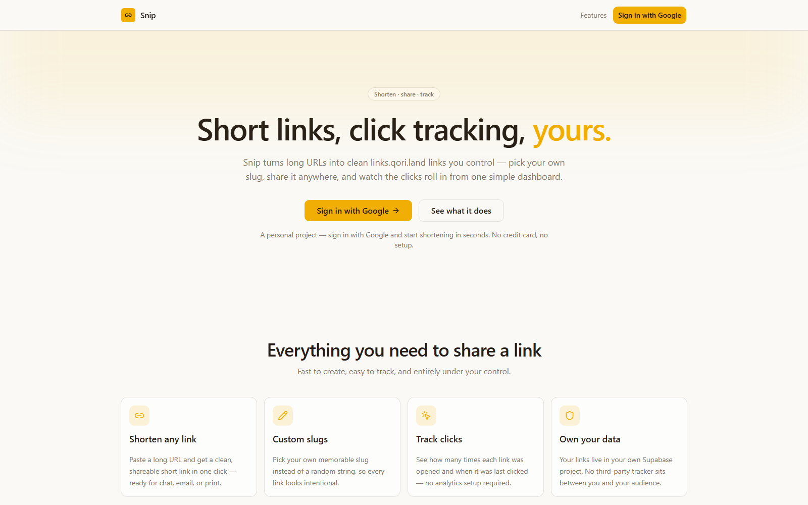

<div align="center">


# Snip

**Short links, click tracking, yours.**

[](https://nextjs.org)
[](https://www.typescriptlang.org)
[](https://supabase.com)
[](https://vercel.com)

### [▶ Live demo →](https://links.qori.land)

</div>

<p align="center">
  
</p>

---

Snip is a personal URL shortener. Sign in with Google, paste a long URL, pick your own slug, and get a
clean `links.qori.land/your-slug` link you can share anywhere — then watch the clicks roll in from one
simple dashboard. Short links are public: anyone you share them with is redirected, no account needed.
It shares the **Qori "Sovereign" design system** with the rest of the suite.

## What it does

```
Sign in  →  Paste a URL  →  Pick a slug  →  Share  →  Track the clicks
```

- **`/`** — the landing page for visitors; your link dashboard once signed in (create + list links).
- **`/login`** — Google sign-in.
- **`/[slug]`** — public redirect handler. Calls the `resolve_link` Postgres function, which
  increments the click count and returns the target. Open to everyone, no account required.
- **`/api/links`** — create / list your links; **`/api/links/[id]`** — delete.

## Highlights

- **Custom slugs** — pick a memorable slug instead of a random string, so every link looks intentional
- **Click tracking** — see how many times each link was opened and when it was last clicked
- **Own your data** — links live in your own Supabase project, isolated per user with Row-Level Security
- **Public redirects** — short links resolve atomically via a security-definer Postgres function
- **On-brand** — the Qori mark, tokens, and Geist fonts, consistent with the rest of the suite

## Tech stack

| Layer | Choice |
|---|---|
| Framework | Next.js 14 (App Router) + TypeScript |
| UI | Tailwind CSS + `@base-ui/react`, React Query, sonner |
| Auth & data | Supabase — Google OAuth, Postgres (RLS) |
| IDs | nanoid |
| Hosting | Vercel |

## Run it locally

```bash
npm install
cp .env.example .env.local   # fill in the values below
npm run dev                  # http://localhost:3000
```

Set `NEXT_PUBLIC_SUPABASE_URL`, `NEXT_PUBLIC_SUPABASE_ANON_KEY`, and
`NEXT_PUBLIC_SITE_URL=http://localhost:3000`. Apply `supabase/migrations/0001_init.sql` (creates the
`links` table with RLS plus the `resolve_link` redirect function), enable the Google provider in
Supabase Auth, and add `http://localhost:3000/auth/callback` to the redirect allow-list.

## Roadmap

- QR codes for any short link
- Optional link expiry and one-time links
- A small clicks-over-time chart per link
- Bulk import / export of links

---

Part of **[Qori](https://qori.land)** · built by **Lucas Ruiz**
